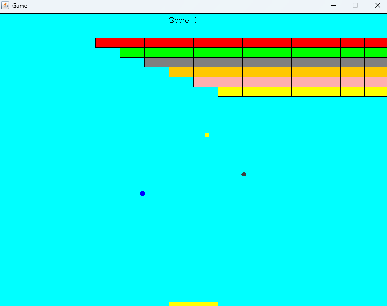

# Arkanoid
Arkanoid-style game developed in java as part of OOP class academic project

## 🎮 About the Project
This game was developed as a course assignment to practice and showcase **OOP principles** in a hands-on context.  
It is implemented using a **single-threaded architecture**, which is unusual for real-time games, highlighting careful management of the game loop and event handling within a single thread.

## 📌 Project Overview
The game follows the classic Arkanoid mechanics:
- A paddle controlled by the player
- A ball that bounces off surfaces
- Bricks that disappear when hit
- A scoring system and win/lose conditions

 The main goal of the project was to apply **OOP principles** in a practical setting.
 ## 🛠️ Features
- Modular **object-oriented design** (Ball, Paddle, Brick, Game logic)  
- **Collision detection** for realistic interactions  
- Single-level gameplay with a basic scoring system

## 🔧 How to Run
1. Clone or download this repository.  
2. Open the project in your preferred Java IDE (e.g., IntelliJ IDEA, Eclipse).  
3. Make sure you have `biuoop-1.4.jar` (the GUI framework provided for the course) in the project’s classpath.  
4. Run the Ass5Game.java class.

## 🖼️ Game Preview

